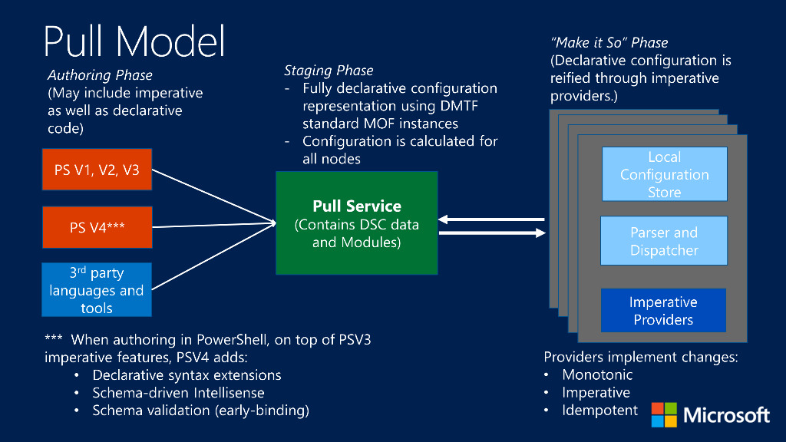
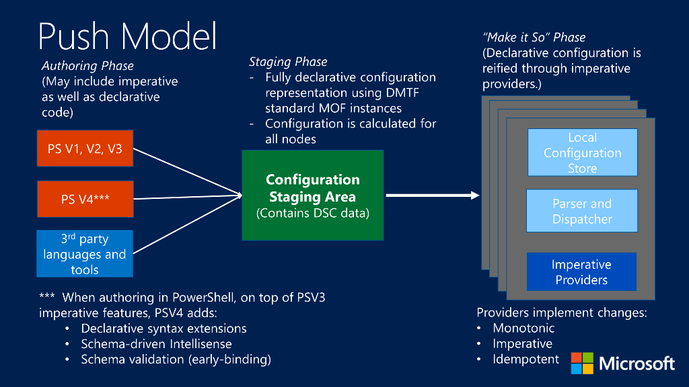

Desired State Configuration [(DSC)](https://docs.microsoft.com/en-us/powershell/scripting/dsc/getting-started/wingettingstarted?view=powershell-7) automates administrations and make it less an hassle, it decreases the complexity of scripting in windows and Linux systems and increase the speed of iteration, it is basically configuration as code (Infrastructure As Code). This feature is available beginning the release of powershell version 4.<!--more-->

# Index

* TOC
{:toc}

# Why DSC configuration ?
Let's say you have configured your systems and everything is working fine, you went on vacation, but before you leave you gave access to another team within your organization to the system, let's say the servers, and when you come back some roles and features have been deleted or added, little tweaks were made either intentionally or unintentionally by your fellow colleagues which unfortunately break your golden system configuration(s) well most of the time you find yourself asking "God what did change!" you spend countless hours trying to figure out what have changed, well this is where PowerShell Desired State Configurations become handy, DSC `ENSURE` that your system has the correct configurations no matter what by preventing configurations drift. But wait not only that, it can also avoid waste of resources by ensuring your system is configured the way it should be, the desired way in order to prevent costly deployment failure.

Now let's say you had DSC configuration implemented in your system, in that case the changes that your fellow engineers made on the system while you were on vacation DSC would have take care of them by making sure that the system configuration get reverted to it's original state.

# Structure of a DSC configuration
A DSC configuration is nothing more than a special kind of powershell function, as you can see below it is pretty straight forward.

``` posh
Configuration myconfig
{
   Import-DscResource -Module PSDesiredStateConfiguration
   Node mynode
   {
      WindowsFeature myrole
      {
          Ensure      = "Present"
          Name        = "Web-Server"  
      }
   }
}
```

{:.box-note}
**myconfig** is the name of the configuration, **mynode** is the machine the configuration will be applied to, **myrole** is the resource we will configure on the target node.


# Key Components of DSC

Working with DSC will have you familiar with the following terms such as:

* `DSC Resources`
* `DSC Configurations`
* `LCM (Local Configuration Manager)`
* `Pull Model`
* `Push Model`
 
## DSC Resources
 
Desired State Configuration Resources provide the building blocks for a DSC configuration. A resource exposes properties that can be configured `schema` and contains the PowerShell script functions that the Local Configuration Manager `LCM` calls to what Microsoft call the `make it so` phase.
 
## DSC Configurations
 
 Configurations are codes that define what the resources should do, they consists of the following parts:

* The Configuration block.
* One or more Node blocks.
* One or more resource blocks.
 
## LCM (Local Configuration Manager)

The Local Configuration Manager `LCM` is the engine of Desired State Configuration (DSC). The LCM runs on every target node, and is responsible for parsing and enacting configurations that are sent to the node. It is also responsible for a number of other aspects of DSC, including the following.

* Determining refresh mode (push or pull).
* Specifying how often a node pulls and enacts configurations.
* Associating the node with pull service.
* Specifying partial configurations.

## Pull Server or Pull Model
In pull mode, pull clients are configured to get their desired state configurations from a remote pull service. 



## Push Model
Push mode refers to a user actively applying a configuration to a target node by calling the `Start-DscConfiguration` cmdlet.


